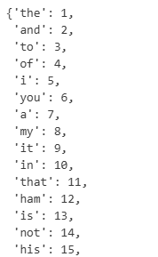
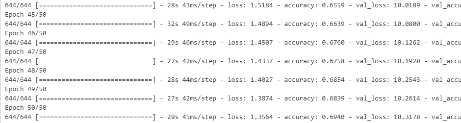

# 📝 Next Word Prediction Using LSTM/GRU

This project is part of a **learning-based project from a Udemy [Complete Data Science, Machine Learning, DL, NLP Bootcamp](https://www.udemy.com/certificate/UC-14b8d5ed-d5a1-4bb7-95c6-1788c0df30b9/)**.  
The objective is to build a **next-word prediction model** using **Long Short-Term Memory (LSTM) or Gated Recurrent Unit (GRU)** networks, trained on Shakespeare’s *Hamlet*, and deploy it as an interactive web application.

> ⚠️ This is a **guided educational project**, not a final capstone, designed to demonstrate sequence modeling and deployment workflows.

---

## 📌 Project Objectives

1. Implement **text preprocessing** and tokenization for sequence data.
2. Build and train both **LSTM and GRU-based language models** for next-word prediction (with the option to use either).
3. Incorporate **early stopping** to prevent overfitting.
4. Develop a **Streamlit web app** for real-time predictions.
5. Deploy the model online via **Streamlit Community Cloud**.

---

## 📊 Dataset & Preprocessing

- **Dataset**: Shakespeare’s *Hamlet* (from NLTK Gutenberg)
- **Vocabulary Size**: 4,818 unique words
- **Sequence Length**: 14 tokens (padded)
- **Total Sequences**: 14,531 n-gram samples

### Preprocessing Steps:
1. Text lowercasing and tokenization
2. Creation of n-gram sequences (sliding window)
3. Padding to uniform length (`max_sequence_len = 14`)
4. Train-test split (80/20)



---

## 🧠 Model Architecture

The project implements **two recurrent architectures** — LSTM and GRU — allowing flexibility in model selection. During development, the GRU model was ultimately trained, but both are included in the code for comparison.

### LSTM Model (Commented Out)
```
Embedding Layer (input_dim=4818, output_dim=100)
↓
LSTM Layer (150 units, return_sequences=True)
↓
Dropout (0.2)
↓
LSTM Layer (100 units)
↓
Dense Layer (4818 units, softmax)
```

**Total Parameters (LSTM)**: 1,219,418 (4.65 MB)

### GRU Model (Final Model Used)
```
Embedding Layer (input_dim=4818, output_dim=100)
↓
GRU Layer (150 units, return_sequences=True)
↓
Dropout (0.2)
↓
GRU Layer (100 units)
↓
Dense Layer (4818 units, softmax)
```

**Total Parameters (GRU)**: 1,157,418 (4.42 MB)

### Switching Between Models
In the notebook, the LSTM model is defined first, followed by the GRU model. To use LSTM instead of GRU, simply **comment out the GRU section** and **uncomment the LSTM section**.

```python
### LSTM RNN
# model = Sequential()
# model.add(Embedding(total_words, 100, input_length=max_sequence_len-1))
# model.add(LSTM(150, return_sequences=True))
# model.add(Dropout(0.2))
# model.add(LSTM(100))
# model.add(Dense(total_words, activation="softmax"))
# model.compile(loss="categorical_crossentropy", optimizer='adam', metrics=['accuracy'])

### GRU RNN (Active)
model = Sequential()
model.add(Embedding(total_words, 100, input_length=max_sequence_len-1))
model.add(GRU(150, return_sequences=True))
model.add(Dropout(0.2))
model.add(GRU(100))
model.add(Dense(total_words, activation="softmax"))
model.compile(loss="categorical_crossentropy", optimizer='adam', metrics=['accuracy'])
```

### Training Details:
- **Optimizer**: Adam
- **Loss**: Categorical Crossentropy
- **Metrics**: Accuracy
- **Batch Size**: Default
- **Epochs**: 50 (with early stopping)
- **Early Stopping**: Monitors `val_loss`, patience=3

### Final Performance (GRU):
- **Training Accuracy**: ~69%
- **Validation Accuracy**: ~5.4%
- **Validation Loss**: ~10.32

> ⚠️ Note: The model shows signs of overfitting, which is expected given the small dataset and the complexity of Shakespearean English. This project focuses on workflow, not state-of-the-art accuracy.



---

## 🔧 Workflow

### 1. Data Loading & Exploration
- Load *Hamlet* from NLTK
- Inspect text length and structure

### 2. Tokenization & Sequence Creation
- Fit tokenizer on full text
- Create n-gram sequences for training
- Pad sequences to uniform length

### 3. Model Building
- Define both LSTM and GRU architectures
- Compile selected model with categorical crossentropy

### 4. Training with Early Stopping
- Train for 50 epochs
- Monitor validation loss
- Save best model

### 5. Prediction Function
- Implement `predict_next_word()`
- Test with sample inputs

### 6. Deployment
- Load model and tokenizer
- Create Streamlit interface
- Deploy to Streamlit Cloud


---

## 🌐 Live Deployment

The model is deployed online via **Streamlit Community Cloud**:

🔗 **Live App**: [https://nextwordpredictiongrurnndlproject.streamlit.app/](https://nextwordpredictiongrurnndlproject.streamlit.app/)

### Features:
- User-friendly text input
- Real-time next-word prediction
- Clean, responsive UI
- Example prompt: *"To be or not to"* → predicts *"when"*

---

## 🛠️ Tech Stack

- **Language**: Python
- **Deep Learning**: TensorFlow, Keras
- **NLP Toolkit**: NLTK
- **Data Processing**: NumPy
- **Web Framework**: Streamlit
- **Serialization**: Pickle
- **Deployment**: Streamlit Community Cloud
- **Version Control**: Git & GitHub

---

## 📚 Learning Outcomes

This project helped me understand:

- Text preprocessing for sequence modeling
- Building and training both LSTM and GRU networks for NLP
- Comparing different RNN architectures
- Implementing early stopping in Keras
- Saving and loading models and tokenizers
- Creating interactive web apps with Streamlit
- Deploying deep learning models to the cloud

---

## ⚠️ Limitations & Future Improvements

- **Small Dataset**: Training on a single play limits vocabulary and context.
- **Overfitting**: High training accuracy but low validation accuracy.
- **Complex Language**: Shakespearean English is archaic and challenging for a small model.

**Possible Improvements:**
- Use larger corpus (e.g., full Shakespeare works)
- Implement attention mechanisms
- Use pre-trained embeddings (GloVe, Word2Vec)
- Fine-tune a transformer model (e.g., GPT-2 small)
- Experiment with both LSTM and GRU architectures on larger datasets

---

**Project Completed as Part of Data Science / Deep Learning Bootcamp**  
*Guided project for educational purposes.*